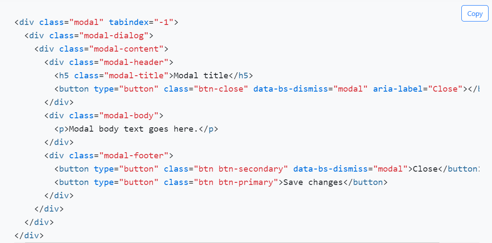
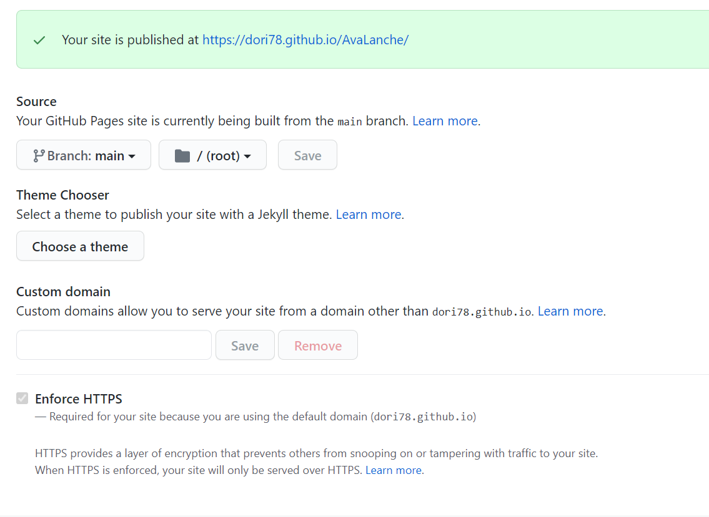

# AvaLanche Cafe - Milestone 1
View via Github Pages [here]()

![Am I Responsive] ()
## Table of Content
[UX](#ux)

[1.Strategy](#strategy)

[2.Scope](#scope)

[3.Structure](#structure)

[4.Sceleton](#sceleton)

[5.Surface](#surface)

[Features](#featutes)

[Design](#Design)

[Technologies](#technologies)

[Testing](#testing)

[Deployment](#deployment)

[Bugs and Issues](#bugs-and-issues)

[Credits and Resources](#credits-and-resources)

 
# UX
### **1. Strategy**
My project is to produce a simple and easy to navigate site about a newly opened cafe in the town of Ruse, Bulgaria. The information about the site is spread over six pages, where each page has its own purpose.The main strategy of the site is to turn visitors into customers. Once the user has explored the site they would be interested to visit the place and return.The main goal of the site is to attract new clients and make the cafe well-known in town. The site is designed to be informative, accessible on all devices and simple to navigate around. I have tried to keep the site simple, because many users have limited technical knowleadge and sometimes feel unconfident to navigate around sites.
#### User Stories
##### As a first time visitor I want to:
- understand the purpose of the website
- be able to see the information comfortably on my mobile
- be able to read and look at the images on smaller devices
- find out where the cafe is located
- be able to navigate easily around the site and don't get lost in the content
- be able to see what facilities the cafe has
- be able to view photos of the cafe and drinks offered
- know what previous customers think about the place
##### As a returning visitor I want to:
- be able to leave feedback about my experience
- know more about new drinks and services offered to make sure I am not missing out
- be able to contact the place through social media
### **2. Scope**
The homepage is designed to make the user stay on the site and look further into it. The logo is in the header to help the new clients remember the name and will have a trade mark effect. Images of the cafe on every page will give a glimpse of the atmosphere and the drinks offered and will tempt the clients to visit. The main feature to achieve the goals will be photos from the place and keeping each page simple to allow the user absorb the information in small bites. The user will also be able to locate the cafe from the map link at the bottom of every page. Other features I plan to include to achieve the site goals are contact forms and site being mobile responsive. 
### **3. Structure**
The information about the cafe is structures to first familiarise the user with the place by a short description of where to find them and what to expect from their visit. Their is a brief history of the place and on the menu page explanation of the most attractive drinks offered  followed by customer's reviews and contact details and finally a carousel with  professionaly taken pictures around the cafe, facilities and drinks photos. The user can navigate and return easily from the navbar. The information on every page is spread out to avoid overloading with information, but the user will be prompted to look further into the site.This will be achieved by keeping the navbar sticked to top on every page. The site is structured based on images rather than text. This will benefit users with reading difficulties and poor eyesight looking at the site on smaller devices.
### **4. Sceleton**
From the **links bellow** you can see the wireframes on different devices starting with mobile, as a device used by most users. From the wireframes the user will  have a better idea of the structure of the site and the relationship between the content. 
 #### **Wireframes**
- [Mobile](wireframes/mobile.pdf)
- [Tablet](wireframes/tablet.pdf)
- [Desktop](wireframes/desktop.pdf)
---
### **5. Surface** - design of the website
* **Homepage** - the header consists of a logo, name of the cafe, est. year and address. The navbar was styled using Bootstrap, to give it responsiveness and is sticked to the top on all pages to avoid the user scrolling up to access another page.The video is interactive and prompts the user to scroll down where the user can see a photo of the outdoor seating area , giving more realistic view of the cafe. Some facilities and products are mentioned here to make user look further into the site. The footer has three links to social media and Google map.
* **About** - there is a short description of how the cafe was established and its attractive location. The eyecatching elements here are the text background and the pouring coffee image. Information about the opening hours is also included here. By now the user will have enough information to make him/her want to see what the place offers and move to menu page.
* **Menu** - it starts with a slogan and an image of the most iconic drinks of the cafe that makes them different. Then there are four sections giving information about the hot, cold, alcoholic and bubble tea selection with a photo and a text followed by a dropdown of the drinks range. 
* **Testimonials** - consist of several reviews of existing clients with photos, creating trust and confidence in the new clients and further tickling their curiosity to visit the cafe.
* **Contact** - page where the user can use simple form to leave feedback or use a form to book a party. They will be able to leave details for the management to contact them for more information. There is also a frame of a location map, in case if the user has missed the link in the footer and for clearer view of the address. This iframe will benefit non-technical users, instead of levaing the site to stay on it and see the address on this page.
* **Gallery** - the most attractive page to reveal a huge selection of professionaly taken photos. A carousel will hold the user's attention by scrolling sideways and fixed images bellow is an engaging way to show the visitor the beauty of the cafe. This is the point where the user should think: *"Yes, I am deffinitely going to visit this place"*
---

# Features
The main idea when designing this site is to be responsive on all devices this is why I have taken particular care with mobile devices. I have ensured that all the information and images are visible and easy to read following the industry recommendations of displaying more than three word within a line of text. Where appropriate the text wraps the images and the bigger background images have been replaced with a wallpaper on smaller devices to allow the user follow the information in more structured way, but still give the site colour.
### **Existing Features**
- video, which repeatedly runs for 10 seconds and there are no control buttons visible. It is more like an interactive decoration of the Homepage
 - navbar is sticked to the top, which is displayed in each page so the user can go forward and backward with a simple click instead of scrolling up and down. This will benefit mobile users, where the content takes more space. The navbar also colapses on smaller devices into a Burger Menu
 - I have included either an image or a photo as a background to give the site more colourfull look
 - the links in the footer take the user to external sites for more information
 - the dropdown on Menu page reveals additional information, but is designed to be optional, because the site's strategy is to prompt the user to visit the cafe
 - the carousel on Gallery page is meant to grab the user's attention in case they feel tired or bored of surfing around the site. 
 - the forms on Contact page are simple and easy to fill with minimum technical knowleadge 
 - language translator -

### **Features to implement**
- In the feature I would like to enable the user to buy a gift card on the site
- I would like to add features for the customers to be able to book their party on the site and this is to be coordinated with the cafe's diary
- I woould loke to include a feature, where the customers can register on the site to receive news about offers and new drinks
- I would like to enable the user to collect points through a digital reward system
- I would like to include online ordering and delivery features
---
# Design
### Colours
- the main colour used on the header and footer is grey/#696969/ to match the colour of the logo. I have also used the same colour for the font throughout the site. Photos have a #696969 border, which I think gives very stylish look and is matching well with the other elements on each page.The additional colours are  white and black on the text to make it stand out and be easy to read depending on the background. I have only used these  three colours to create simplicity and make the photos stand out.
### Typography
- I have used Montserrat and Chango with Sans Serif as a fallback to reflect the font of the logo. Chango have been used for headers and slogans, while Montserrat for text. The weight of the font has been reduced or increased based on the other elements  of each page. The size of the font is choosen individually on each page to cooperate with the images.
### Images
- the images used in the side are provided by the owner. I have used other images as well as a background.  All additional images used are taken from [Pexels](https://www.pexels.com/). All images came in different sizes and to make them look balanced with the other elements I have reduced or incresed the size.
### Media
- the  short video of the steaming cup of coffee on the Homepage has been downloaded from [Pexels](https://www.pexels.com/) It has no sound, because is designed to give more delicate feeling and look of the site. 
---
# Technologies  
#### [HTML](https://www.w3schools.com/html/)
#### [CSS](https://www.w3schools.com/css/)
#### [Balsamiq](https://balsamiq.com/) : used to create wireframes
#### [Google Fonts](https://fonts.google.com/)
#### [Font Awesome](https://fontawesome.com/) : used icons for the footer
#### [Bootstrap5](https://getbootstrap.com/) : only used to code the navbar, footer and form modal. I used two snippets:
- [Bootstrap-navbar-toggler](https://getbootstrap.com/docs/5.0/components/navbar/)
- 
###### Although I appreciate the benefits of using Bootstrap I felt like building the website using my own code, I found it more challenging and educational. It made me do additional researches and solve problems. I have used media query to make the site responsive.
#### [JavaScript](https://en.wikipedia.org/wiki/JavaScript) : used to design the carousel and form modal 
#### [Google Maps API](https://developers.google.com/maps/documentation/embed/get-started) : to display a map within a frame
#### [Visual Studio Code](https://code.visualstudio.com/) : the most widely used development workplace
#### [Github](https://github.com/) : for remote access of the site
#### [Chrome Developer Tool](https://developer.chrome.com/docs/devtools/) : to inspect code and help fix issues
#### [Flexbox](https://www.sketchingwithcss.com/samplechapter/cheatsheet.html) : used as a powerful tool to move items on a page.
---
# Testing
### [HTML validation](https://validator.w3.org/)
### [CSS validation](https://jigsaw.w3.org/css-validator/)
### [Lighthouse Testing](https://developers.google.com/web/tools/lighthouse) : to improve the quality of the web page
### **Manual testing** - in my opinion manually testing a site on different devices gives the best overview and points out any issues with design and responsiveness. I had to fix a few things that were not showing on Google Dev Tool, but I found out about them when I was inspecting the site manually. The devices that the project was tested on are:
- Dell Inspiron laptop
- MacBook pro
- Ipad Air2
- Iphone 8 and 11
---
# Deployment
### [**GitHub Pages**](https://pages.github.com/) - it is used to host a website directly from a GitHub repository. I used the following steps to deploy my project on GitHub Pages:
- I opened the repo from my GitHub account and clicked **Settings** on the upper right side corner
- I scrolled down to **Pages**
- then I choose **Public** visibility
- from the **Source** section I selected branch **Master** and pressed **Save**
- the site was hosted on **GitHub Pages**
- I waited a few minutes before I could see it live

### **Fork a repo on GitHub** - forking allows to make a copy of the original and make changes without affecting the original. I followed the next steps:
- from the repo page select **Fork** button on the upper right corner
- the copy was made on the GitHub account
---
# Bugs and Issues
### Throughout the project I expereinced the following issues , which I fixed mainly by researching the web:
- I experienced an issue with GitHub Desktop program- it stopped working for no reason, some of my code got lost and messed up my fully completed Homepage. I also had an error message when I tried to push to GitHub. I investigated in the Task Manager, but it wasn't showing there. I uninstalled and installed it again which worked. Then I found in my commit history my old code and copied it into my index.html and CSS. I couldn't find any information about what could have caused this
- Because I am writing my own code and not using snippets and Bootstrap for most of the project I had issues with the responsiveness on a tablet and a mobile. This made me research about media query  and understand it and I fixed the issues by applying media query for devices of max-width: 576px and 768px
- I found out that using percentages instead of px when appropriate gives me more flexibility and responsiveness
- All pages were wobbling to left and right, there seemed to be a slight margin, but by applying a value hidden to the body overflow-x this was fixed
- Navbar- the navbar was taking too much of the screen space on mobile devices and I had to design a Burger Menu to make it more user friendly
- Homepage - the browser was applying a left and right margin, which I fixed by giving a "0" margin and padding of the main container in the CSS. Also the two line text over the video never looked at the right place. If it was OK on desktop, was out of alignment on mobile and again at different position on a tablet. I inspected it with the Google Dev Tool and corrected the values
- About- the background image was not looking good on smaller devices, so I replaced it with a wallpaper by media query
- Menu- the containers with a text and image were wrapping nicely on mobile devices, but they were not in order- instead of image-text-image-text it was rendering as image-text-text-image. I found out how to fix this by exploring Flexbox and used the property flex-direction:column-reverse
- 
---
# Credits and Resources
## I would like to thank the AvaLance Cafe management for providing me with the photos and information about the cafe.
---
### Code Institute- for providing the course materials
### YourTube- for quick and effective advice 
### W3Schools- for the useful examples and detailed explanation
### Developer Mozilla- for the documentation and learning resources
### Tympanus- for the extended CSS reference 
### My mentor Dick Vlaanderen- for the useful tips and support

